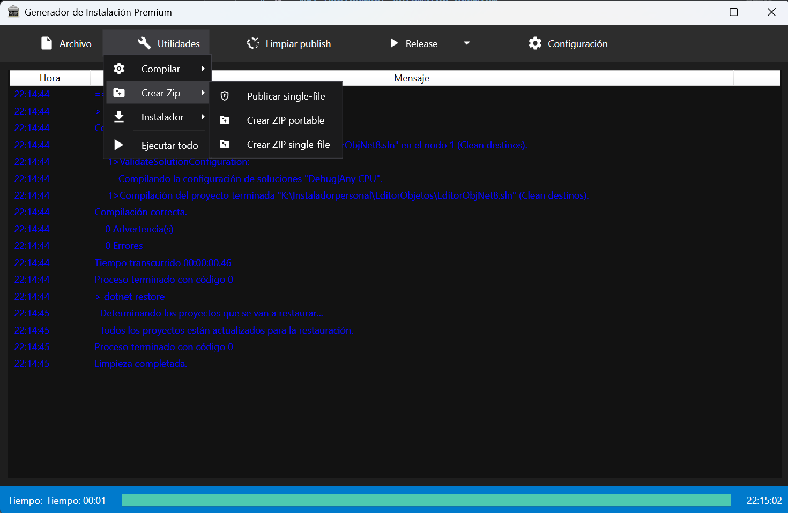

# 🛠️ .NET Deployment Automator Premium



**Elevate your deployment workflow.** Una solución integral de escritorio diseñada para automatizar el ciclo de vida de empaquetado y distribución de aplicaciones .NET con una experiencia de usuario excepcional.

---

## 💎 Propuesta de Valor

Este ecosistema automatiza tareas repetitivas y críticas de despliegue, eliminando errores manuales y garantizando que cada entrega cumpla con los estándares de calidad profesional.

### Características Principales

* **🎨 Interfaz de Nueva Generación**: Desarrollada en **WPF** siguiendo el patrón **MVVM**, con un tema oscuro "Deep Charcoal" y micro-animaciones.
* **📐 Iconografía Vectorial Escalamble**: Implementación completa de iconos SVG (Static Geometry) para una nitidez absoluta.
* **⚡ Motor de Compilación Inteligente**: Abstracción del CLI de .NET que permite alternar entre perfiles y configurar opciones avanzadas (`ReadyToRun`, `Trimming`).
* **📂 Gestión Multi-Proyecto**: Selector inteligente para cambiar entre diferentes configuraciones de aplicaciones instantáneamente.
* **📦 Empaquetado Profesional**: Generación de Single-File, ZIP y archivos de instalación mediante **Inno Setup**.
* **🔔 Notificaciones de Sistema**: Avisos nativos (Toast) al finalizar procesos largos.
* **🛠️ Herramientas de Robustez**: Auto-detección de compiladores y validación de rutas en tiempo real.
* **🔗 Ecosistema Git Integrado**: Monitorización de ramas y cambios pendientes directamente en la aplicación.
* **❓ Soporte y Ayuda**: Manual de usuario integrado y centro de ayuda.

---

## 🚀 Guía de Inicio Rápido

### Requisitos del Sistema

1. **Framework**: [.NET SDK 8.0+](https://dotnet.microsoft.com/download)
2. **Engine de Instalación**: [Inno Setup 6+](https://jrsoftware.org/isdl.php)

### Configuración del Entorno

Localice el archivo `config.json` en el directorio raíz y defina los parámetros de su proyecto:

```json
{
  "NombreProyecto": "MiAplicacionEstelar",
  "VersionInstalador": "1.2.0",
  "RutaProyecto": "C:\\Desarrollo\\MiProyecto",
  "RutaPublicacion": "C:\\Despliegues\\ReadyToShip",
  "RutaInnoSetup": "C:\\Program Files (x86)\\Inno Setup 6\\ISCC.exe"
}
```

---

## 🛠️ Flujo de Trabajo Profesional

Para garantizar integridad en sus paquetes, se recomienda seguir este orden de operaciones:

1. **Sanitización**: Ejecute `Limpiar publish` para purgar directorios temporales y restaurar dependencias limpias.
2. **Validación de Perfil**: Verifique que el selector superior coincida con su objetivo (Debug para tests, Release para producción).
3. **Ejecución Maestro (Ultra-Automated)**: Utilice `Utilidades > Ejecutar todo`. El sistema procesará secuencialmente:
    * Compilación de la solución.
    * Publicación optimizada.
    * Generación de artefactos ZIP.
    * Compilación del Script de Instalación.

---

## 🛡️ Arquitectura Técnica

* **Core**: C# 12 / .NET 8 LTS.
* **Presentation Layer**: XAML / WPF con Custom ControlTemplates.
* **Vector Engine**: Static Geometry Resources.
* **Deployment Scripting**: Pascal Script (via Inno Setup).

---

> [!NOTE]
> este software es "Universal". Puede ser reutilizado para cualquier proyecto .NET de consola o escritorio simplemente tienes que configurar las rutas desde el menú de configuración.
---

## 📜 Licencia

Este proyecto está bajo la Licencia **MIT**. Consulte el archivo `LICENSE` para más detalles.
